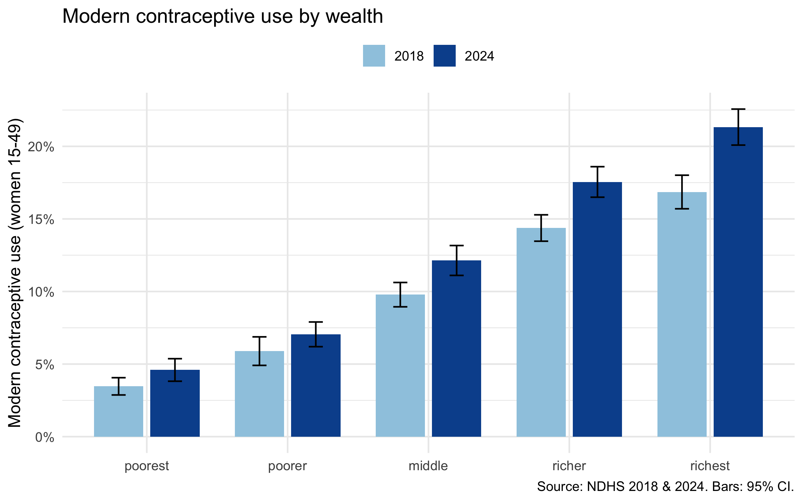
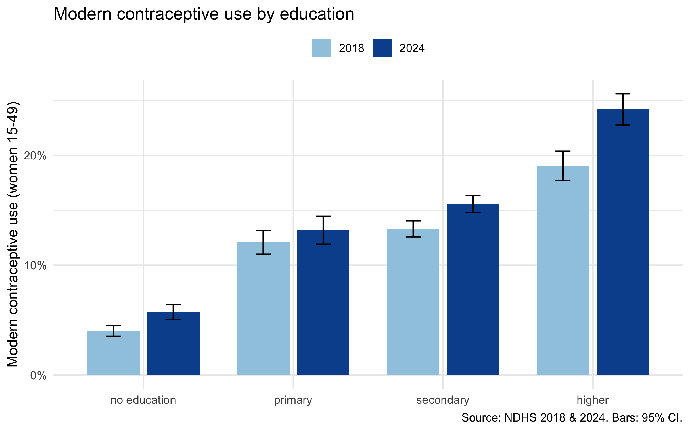
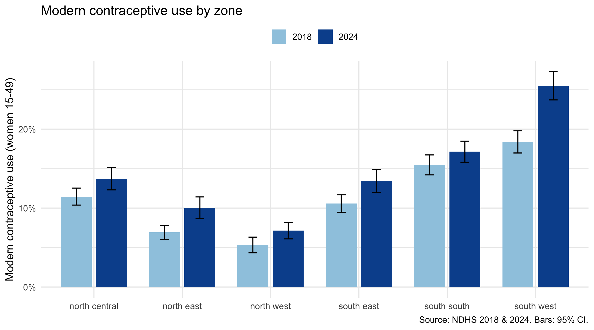
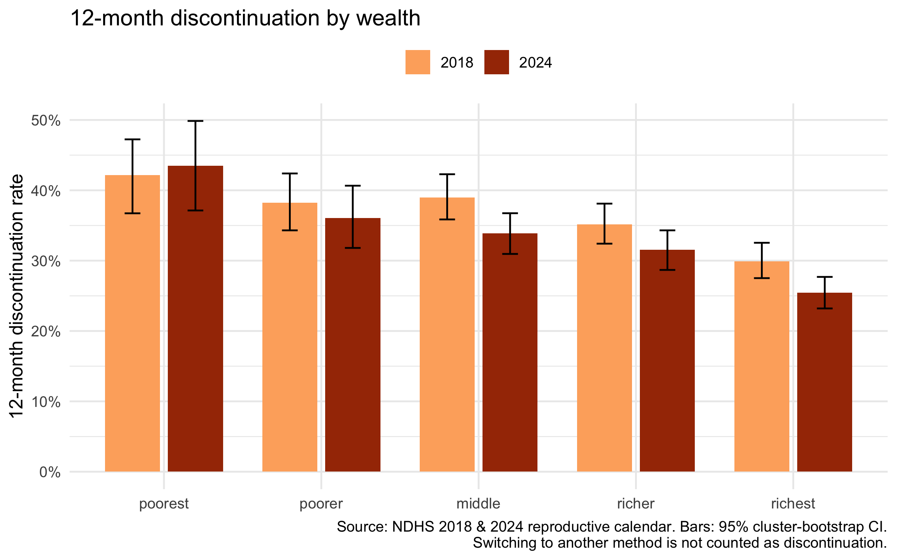
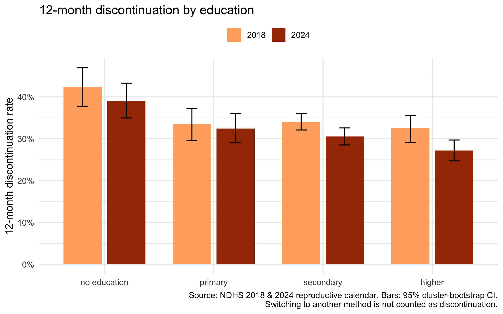
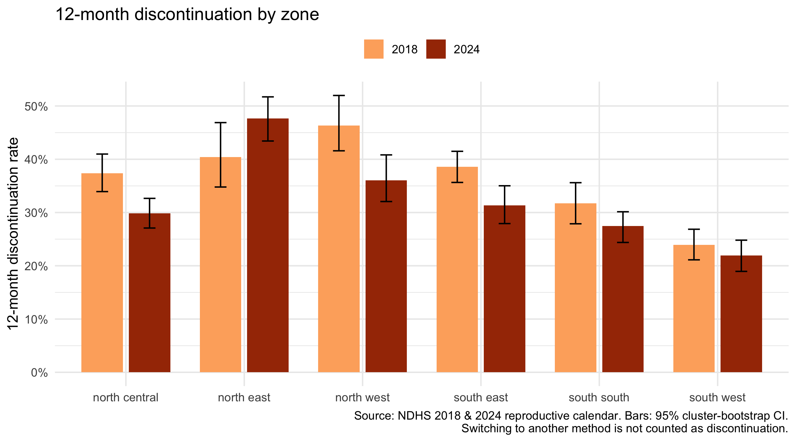
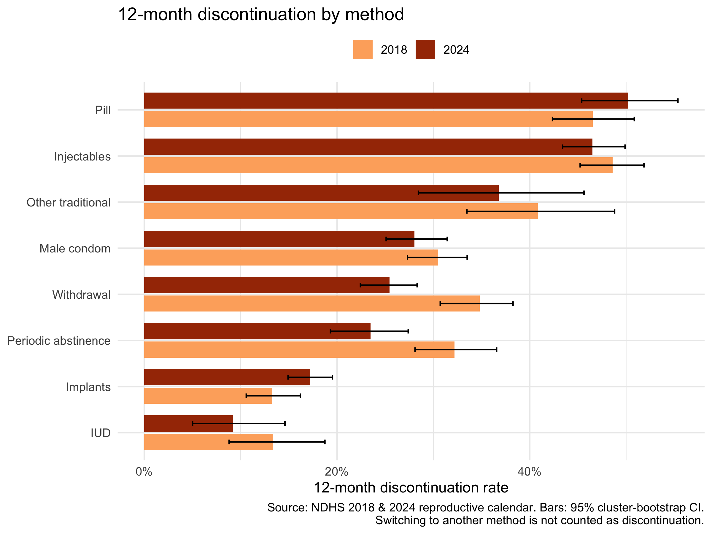
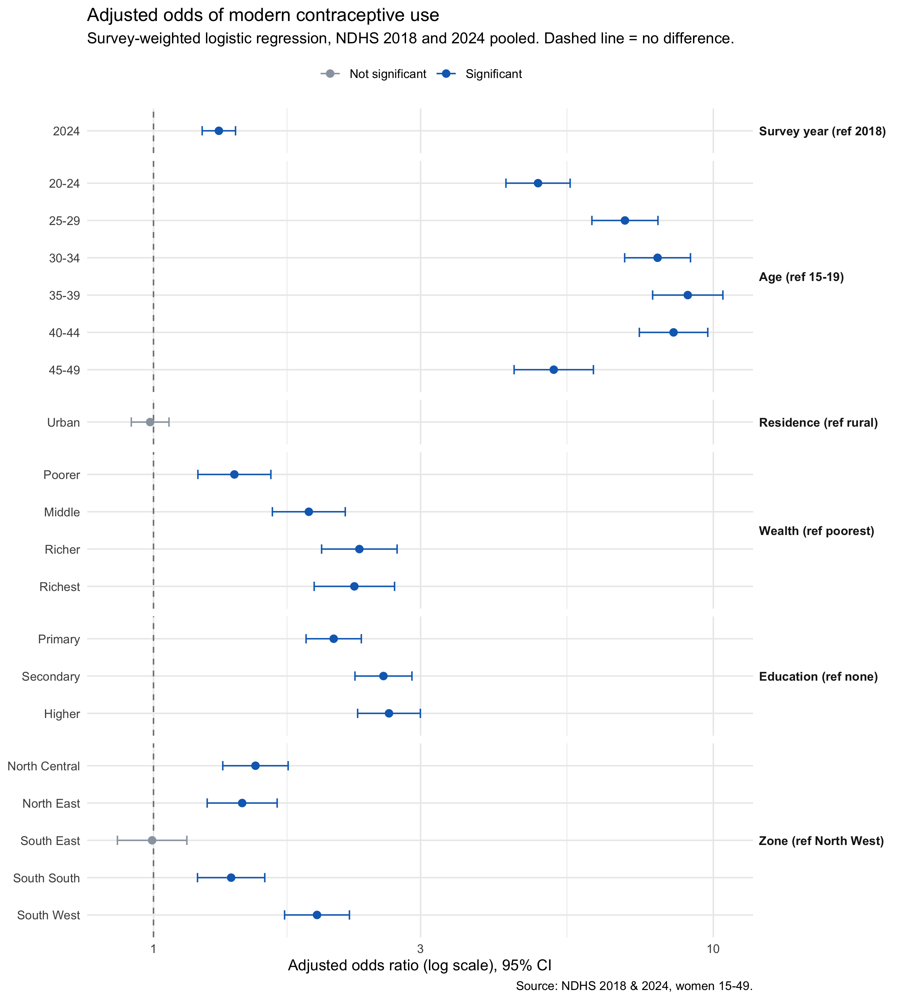

# Findings: Contraceptive Use and Method Retention in Nigeria, 2018 to 2024

**Data:** NDHS 2018 and NDHS 2023-24 (labelled "2024" throughout), women aged 15-49 (41,821 and 39,050 women).
**Author:** Ofikwu Matthew

## Summary

Modern contraceptive use rose from 10.5% to 13.1%, and women who started a method were somewhat more likely to still be using one a year later: 12-month discontinuation fell from 34.6% to 31.2%. But the gains were uneven. Wealthier and better-educated women, and women in the South West, gained the most. The poorest women showed no detectable improvement in retention, and the North East moved in the wrong direction on retention, though that change is not statistically distinguishable from zero.

Access gets women started. Retention keeps them protected. The two tell different stories in different places.

## 1. Modern contraceptive use

All women 15-49, survey-weighted, 95% confidence intervals.

| | 2018 | 2024 | Change (95% CI) |
|---|---|---|---|
| **Overall** | 10.5% (10.0-11.0) | 13.1% (12.5-13.7) | +2.6 pts |

**By wealth**

| | 2018 | 2024 | Change (95% CI) |
|---|---|---|---|
| Poorest | 3.5% | 4.6% | +1.1 (0.2 to 2.1) |
| Poorer | 5.9% | 7.1% | +1.2 (-0.1 to 2.5), not significant |
| Middle | 9.8% | 12.1% | +2.4 (1.0 to 3.7) |
| Richer | 14.4% | 17.5% | +3.2 (1.8 to 4.6) |
| Richest | 16.9% | 21.3% | +4.5 (2.8 to 6.2) |

**By education**

| | 2018 | 2024 | Change (95% CI) |
|---|---|---|---|
| No education | 4.0% | 5.7% | +1.7 (0.9 to 2.6) |
| Primary | 12.1% | 13.2% | +1.1 (-0.6 to 2.8), not significant |
| Secondary | 13.3% | 15.6% | +2.3 (1.2 to 3.3) |
| Higher | 19.0% | 24.2% | +5.2 (3.2 to 7.1) |

**By zone**

| | 2018 | 2024 | Change (95% CI) |
|---|---|---|---|
| North Central | 11.5% | 13.7% | +2.3 (0.5 to 4.0) |
| North East | 6.9% | 10.0% | +3.1 (1.5 to 4.7) |
| North West | 5.3% | 7.1% | +1.8 (0.4 to 3.3) |
| South East | 10.6% | 13.5% | +2.9 (1.1 to 4.7) |
| South South | 15.5% | 17.1% | +1.7 (-0.2 to 3.5), not significant |
| South West | 18.4% | 25.5% | +7.1 (4.8 to 9.4) |

**The gap widened in absolute terms.** The richest-poorest gap in modern use grew by 3.3 percentage points (95% CI 1.4 to 5.3). In relative terms the picture is different: the poorest grew by about a third (3.5% to 4.6%) against about a quarter for the richest (16.9% to 21.3%), but from a base so low that the absolute gap still grew. Both framings are true, and both should be reported.

## 2. 12-month discontinuation

Share of women who stop using a method within 12 months of starting it. Switching to another method is not counted as discontinuation. 95% cluster-bootstrap CIs.

| | 2018 | 2024 | Change (95% CI) |
|---|---|---|---|
| **Overall** | 34.6% | 31.2% | -3.4 pts (-5.8 to -1.1) |

**By wealth**

| | 2018 | 2024 |
|---|---|---|
| Poorest | 42.2% | 43.5% |
| Poorer | 38.2% | 36.1% |
| Middle | 39.0% | 33.9% |
| Richer | 35.2% | 31.6% |
| Richest | 29.9% | 25.4% |

Tested changes: richest -4.5 pts (CI -7.8 to -1.4), a real decline. Poorest +1.3 pts (CI -6.5 to +10.1), no detectable change.

**By education**

| | 2018 | 2024 |
|---|---|---|
| No education | 42.4% | 39.0% |
| Primary | 33.6% | 32.4% |
| Secondary | 34.0% | 30.6% |
| Higher | 32.6% | 27.2% |

**By zone**

| | 2018 | 2024 |
|---|---|---|
| North Central | 37.4% | 29.9% |
| North East | 40.4% | 47.7% |
| North West | 46.3% | 36.0% |
| South East | 38.6% | 31.3% |
| South South | 31.7% | 27.5% |
| South West | 23.9% | 21.9% |

Tested changes: North West -10.3 pts (CI -17.0 to -3.9), a real decline. North East +7.3 pts (CI -0.9 to +14.0), suggestive only.

**By method.** Implants and IUDs are the stickiest methods, with 12-month discontinuation roughly in the 10-17% range. Condoms sit around 30%. Pills and injectables lose close to half of users within a year, in both rounds. See `outputs/disc_method.csv` for estimates with confidence intervals. Method-level cells are small for some methods, so differences between rounds within a single method should be read with care.

## 3. Putting use and retention together

Each arrow runs from a zone's 2018 position to its 2024 position. Right means more use, down means better retention.

- **North West:** use barely moved, but retention improved sharply. Women who use methods there are staying on them.
- **North East:** use rose clearly, but discontinuation appears to have risen too. More women are starting, and possibly more are stopping. This needs a closer look.
- **South West:** the highest and fastest-rising use, with the lowest discontinuation in both rounds.

## 4. Adjusted models

Both surveys pooled, survey-weighted (PSUs and strata kept distinct by year). Reference groups: 2018, age 15-19, rural, poorest, no education, North West. These are adjusted associations, not causal effects.

### 4a. Modern contraceptive use (logistic regression)

Adjusted odds ratios, 95% CI.

| Factor | Adjusted OR (95% CI) |
|---|---|
| **Survey year 2024** (vs 2018) | **1.31 (1.22-1.40)** |
| Age 20-24 | 4.86 (4.26-5.55) |
| Age 25-29 | 6.95 (6.07-7.96) |
| Age 30-34 | 7.95 (6.94-9.10) |
| Age 35-39 | 9.00 (7.79-10.4) |
| Age 40-44 | 8.49 (7.38-9.77) |
| Age 45-49 | 5.19 (4.41-6.11) |
| Urban (vs rural) | 0.99 (0.91-1.07), not significant |
| Wealth: poorer | 1.39 (1.20-1.62) |
| Wealth: middle | 1.89 (1.63-2.20) |
| Wealth: richer | 2.33 (2.00-2.72) |
| Wealth: richest | 2.28 (1.94-2.70) |
| Education: primary | 2.10 (1.87-2.35) |
| Education: secondary | 2.57 (2.29-2.89) |
| Education: higher | 2.63 (2.32-3.00) |
| Zone: North Central | 1.52 (1.33-1.74) |
| Zone: North East | 1.44 (1.25-1.66) |
| Zone: South East | 0.99 (0.86-1.15), not significant |
| Zone: South South | 1.38 (1.20-1.58) |
| Zone: South West | 1.96 (1.71-2.24) |

- **The rise in use is not a composition effect.** The odds of use were 31% higher in 2024 after adjusting for age, residence, wealth, education and zone.
- **Age is the strongest predictor.** Odds peak at ages 35-39 (about 9 times the odds at 15-19) and fall again at 45-49.
- **Wealth and education gradients persist when adjusted for each other.** The wealth effect levels off at the top: richer and richest are statistically indistinguishable.
- **The urban-rural gap disappears** once wealth, education and zone are accounted for.
- **The South East looks no different from the North West** after adjustment, even though its raw use is higher.

### 4b. Did the wealth gap change?

Linear probability model with a year × wealth interaction, so results are in percentage points. The 2024 row is the adjusted change for the poorest women (reference). The other rows are how much *more* each group changed than the poorest. For the richest, that is the **change in the richest-poorest gap**.

| Term | Pts (95% CI) |
|---|---|
| Change for the poorest, 2018 to 2024 | +1.2 (0.3 to 2.1) |
| Extra change: poorer | +0.2 (-1.2 to 1.6), not significant |
| Extra change: middle | +1.3 (-0.2 to 2.8), not significant |
| Extra change: richer | +2.0 (0.4 to 3.6) |
| **Extra change: richest (gap change)** | **+3.0 (1.2 to 4.8)** |

The richest-poorest gap in use widened by about 3 points after adjustment, close to the unadjusted 3.3 points. On the odds scale, a Wald test of the year × wealth interaction found no change in the wealth gradient (F = 0.15, p = 0.96).

Both results can be true. Wealthier women start from a higher level, so the same *relative* rise produces a larger gain in points. For programme planning the absolute gap is the practical measure. The relative result says the poorest women are not falling behind proportionally.

### 4c. 12-month retention (Cox models)

Hazard ratio (HR) below 1 = lower chance of stopping within 12 months = better retention.

| 2024 vs 2018 | HR (95% CI) | p |
|---|---|---|
| Adjusted for wealth, education, zone | 0.86 (0.80-0.94) | 0.0003 |
| ...and also for method | 0.91 (0.84-0.99) | 0.024 |

**Method effects** (vs pill, from the model that includes method):

| Method | HR (95% CI) |
|---|---|
| Implants | 0.24 (0.21-0.28) |
| IUD | 0.21 (0.15-0.29) |
| Male condom | 0.60 (0.53-0.68) |
| Traditional | 0.57 (0.51-0.63) |
| Other modern | 0.58 (0.40-0.84) |
| Injectables | 0.92 (0.83-1.03), not significant |

**Other factors** (same model):
- Wealth: only the richest differ from the poorest (HR 0.76, 0.64-0.89).
- Education: no significant differences.
- Zone (vs North West): South West 0.55 (0.47-0.65), South South 0.71 (0.60-0.83), North Central 0.82 (0.71-0.95). The North East is close to the North West (1.02, 0.87-1.18) and the South East is not significantly different (0.91, 0.78-1.06).

- **Retention improved even among comparable women.** The 2024 hazard of stopping was about 14% lower after adjusting for who the users are.
- **Method mix explains part of it.** Adding method shrinks the 2024 effect from 14% to 9% lower hazard (roughly a third of the effect on the log scale). That is consistent with a shift toward implants and other stickier methods, but it does not prove the shift caused the gain. A significant 2024 effect remains.
- **Implants and IUDs are the stickiest methods by a wide margin:** about 76% and 79% lower hazard of stopping than the pill. Injectables retain about as poorly as the pill.
- **The raw education gradient in retention largely disappears** once wealth, zone and method are held constant.

## What this does and doesn't show

**Supported by the data:** the national rise in modern use; the national fall in discontinuation; the richest and North West declines in discontinuation; the widening absolute wealth gap in use.

**Not supported:** any claim about why. The adjusted retention model suggests that the shift toward stickier methods, mainly implants, accounts for part of the retention gain (the 2024 effect weakens from HR 0.86 to 0.91 once method is added), but it cannot show the shift caused it, and a significant 2024 effect remains. The North East result and the poorest-women result are consistent with no change.

**Implications worth exploring (hypotheses, not findings):**
- Retention support, such as counselling and follow-up, may matter most for pill and injectable users, who have the highest discontinuation.
- The poorest women gained access but not retention. Cost, supply and follow-up barriers could be investigated.
- The North East warrants a dedicated look at both uptake and discontinuation.

## Method notes and limitations

Full methods are in the [README](README.md). The main limitations: calendar data depend on recall; the two discontinuation windows cover different 5-year periods; `n` counts episodes not women; subgroup results are descriptive and unadjusted for multiple comparisons; reasons for discontinuation were not analysed; and the adjusted models show associations, not causal effects. The Cox models' proportional-hazards assumption was not formally checked.
