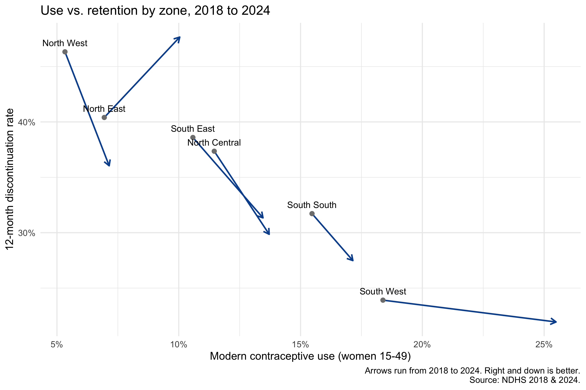

# Contraceptive Use and Method Retention in Nigeria, 2018 to 2024

Who is Nigeria's rise in modern contraceptive use reaching, and are women sticking with the methods they start?

This project answers both questions using the Nigeria Demographic and Health Surveys (NDHS) of 2018 and 2024.

**Author:** Ofikwu Matthew

## Headline findings

| | 2018 | 2024 | Change (95% CI) |
|---|---|---|---|
| Modern contraceptive use, all women 15-49 | 10.5% | 13.1% | Clear rise |
| 12-month method discontinuation | 34.6% | 31.2% | -3.4 pts (-5.8 to -1.1) |

1. **Use rose almost everywhere.** Every wealth, education and zone group rose significantly except the "poorer" quintile, primary-educated women and the South South zone. The South West gained the most (18.4% to 25.5%).
2. **The wealth gap in use widened.** The richest-poorest gap grew by 3.3 percentage points (95% CI 1.4 to 5.3). In relative terms, the poorest grew faster, but from a very low base (3.5% to 4.6%).
3. **Retention improved nationally.** Discontinuation fell by 3.4 points. The gain was concentrated among the richest women (-4.5 pts, CI -7.8 to -1.4) and in the North West (-10.3 pts, CI -17.0 to -3.9). The poorest women showed no detectable change.
4. **The North East is a flag, not a finding.** Use rose clearly (6.9% to 10.0%) while discontinuation rose from 40.4% to 47.7%. That change is not statistically distinguishable from zero (CI -0.9 to +14.0 pts).
5. **Method matters.** Implants and IUDs have the lowest 12-month discontinuation. Pills and injectables lose roughly half of users within a year.

Full results, charts and interpretation are in [FINDINGS.md](FINDINGS.md).



## Data

- NDHS 2018 and NDHS 2024, Individual Recode (IR) files, women aged 15-49 (41,821 and 39,050 women).
- **The data are not included in this repository.** DHS data are free but require registration and approval at [dhsprogram.com](https://dhsprogram.com). Place the files at:
  - `data/raw/ir2018.DTA`
  - `data/raw/ir2024.DTA`

## Methods

**Modern contraceptive use.** Standard DHS definition (`v313 == 3`) among all women 15-49. Estimates use the survey design (PSU `v021`, strata `v022`, weights `v005 / 1e6`) via the `survey` package. Changes between rounds are tested as differences of independent estimates, with SE = sqrt(se18² + se24²).

**12-month discontinuation.** Built from the DHS reproductive calendar (`vcal_1`):
- Each woman's calendar is aligned to her interview month using `v018`, giving one row per woman-month over the 5 years before interview.
- An episode is a run of the same method. Episodes that begin at the oldest edge of the window are dropped (left-censored).
- Switching to another method is censored, not counted as discontinuation (DHS convention). Stopping, or an episode ending in pregnancy or other non-use, counts as discontinuation.
- Sterilization, emergency contraception and LAM are excluded from the headline rates.
- Rates come from a weighted discrete-time life table (monthly hazard = weighted stops / weighted at risk, compounded over 12 months).
- 95% CIs come from a **cluster bootstrap by PSU** (500 replicates). Changes between rounds are tested by bootstrapping the 2024-minus-2018 difference.

**Validation checks.**
- `v018` matched the calendar's leading-blank padding for every woman in both rounds.
- The calendar's character at the interview month matched current method (`v312`) almost one-to-one, in both rounds. This was used to build the code map empirically rather than assume it.
- The calendar-based modern use at the interview month (10.5%, 13.1%) matched the survey-weighted estimates.

## Repository structure

```
analysis.R              # full pipeline, run top to bottom
FINDINGS.md             # results and interpretation
data/raw/               # NDHS files (not included)
outputs/
  charts/               # PNG charts
  *.csv                 # result tables (use, discontinuation, change tests)
  episodes.rds          # cached episode dataset
```

## How to reproduce

1. Get the NDHS 2018 and 2024 IR files and place them in `data/raw/`.
2. Install packages: `haven`, `dplyr`, `tidyr`, `stringr`, `survey`, `ggplot2`.
3. Open `analysis.R` in R or RStudio and run it from the project root.

The discontinuation bootstraps are the slow step. Results are saved to `outputs/` as they finish.

## Limitations

- **Calendar data rely on recall** over up to 5 years, and recall quality can differ between survey rounds.
- **The two discontinuation estimates cover different periods.** Each window is the 5 years before its own survey, so 2018 reflects roughly 2013-2018 and 2024 roughly 2019-2024.
- **`n` in discontinuation tables is episodes, not women.** One woman can contribute several episodes.
- **Subgroup comparisons are descriptive.** No adjustment for multiple comparisons, and splits are one variable at a time, not mutually adjusted.
- **Small cells have wide intervals.** Method-level estimates for IUD and "other traditional" rest on a few hundred episodes.
- **Reasons for discontinuation were not analysed.** The reason codes (`vcal_2`) appear to differ between rounds, so they were not compared. Reasons are recorded in the last month of use, not the month of stopping.
- **Descriptive only.** Nothing here establishes why the changes happened.

## Possible extensions

- Reasons for discontinuation, once the 2024 code list is reconciled with 2018.
- A multivariable model of discontinuation (survival or discrete-time logistic) adjusting for wealth, education, zone and method together.
- State-level estimates, where sample sizes allow.
